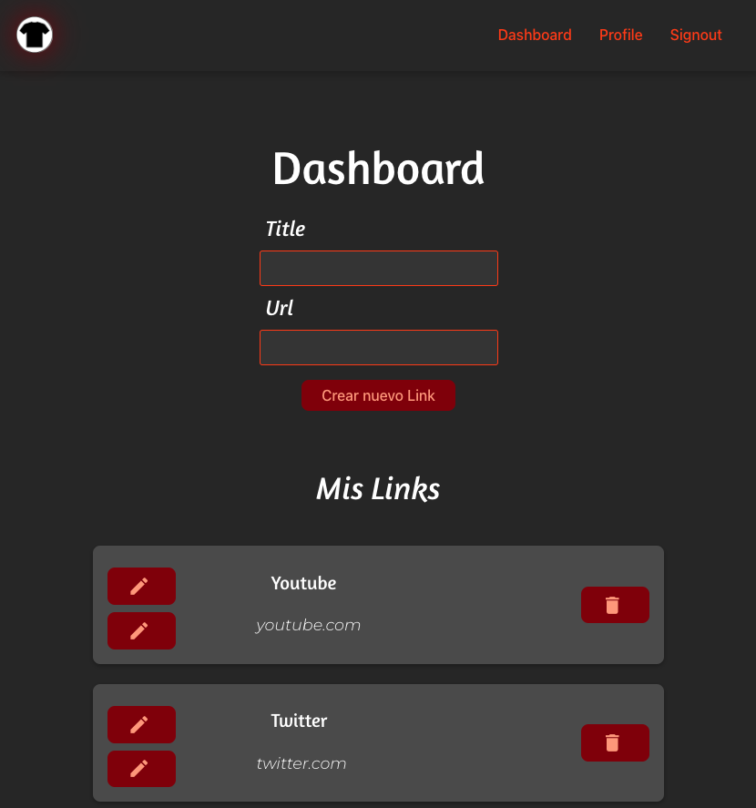
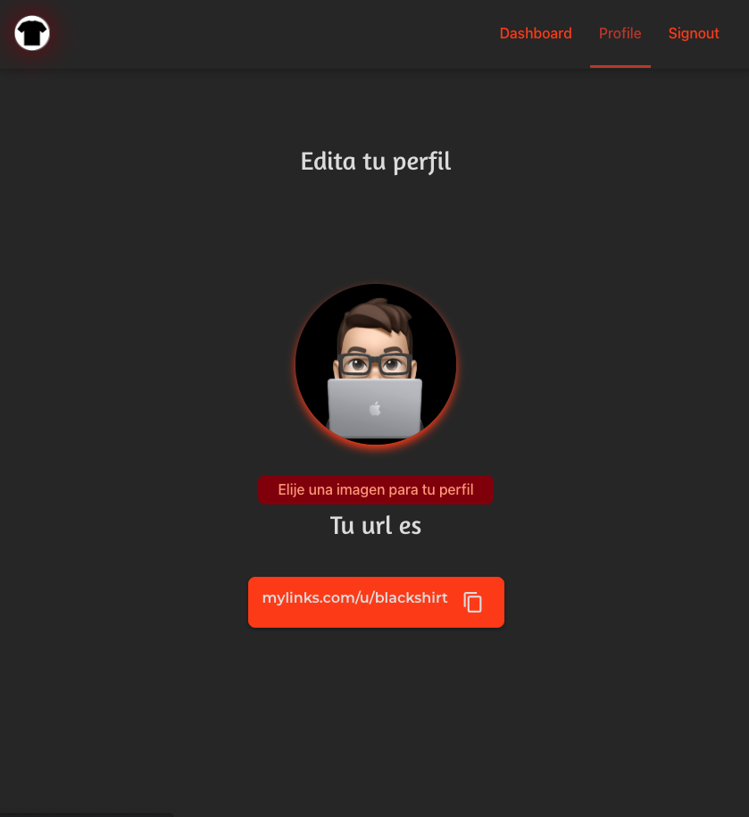

# My Links App

Aplicacion construida para practiar **_ReactJS_**, aprender el uso de **_React Router_** y conocer la plataforma de **_FIREBASE_**, me basé en un tutorial del canal de youtube vidamrr y lo adapté a mis conocimientos.

la idea de esta aplicación es concentrar todos los links de redes sociales en un solo lugar.

Con esta aplicación utilicé servicios de **_Firebase_** como:

- **Autenticación** con google, para iniciar sesión
- **Storage**, para guardar la imagen de usuario
- **Firestore Database**, para guardar los datos de usuario y links
- **Hosting**, para desplegar la app en producción.

en cuanto a los estilos utilicé _CSS_ puro, estilizando cada componente.

---

---

En la vista de Perfil, la imagen de perfil se guarda en **Firebase** y nos mostrará nuestra url para copiarla y compartirla.

